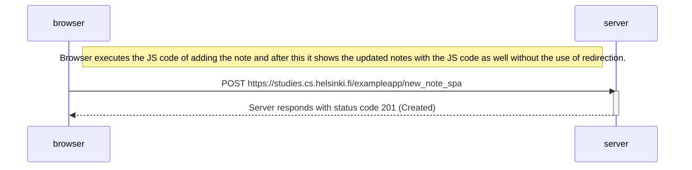

```mermaid
sequenceDiagram
    participant browser
    participant server

    Note right of browser: Browser executes the JS code of adding the note and after this it shows the updated notes with the JS code as well without the use of redirection.
    
    browser->>server: POST https://studies.cs.helsinki.fi/exampleapp/new_note_spa
    activate server
    server-->>browser: Server responds with status code 201 (Created)
    deactivate server
```